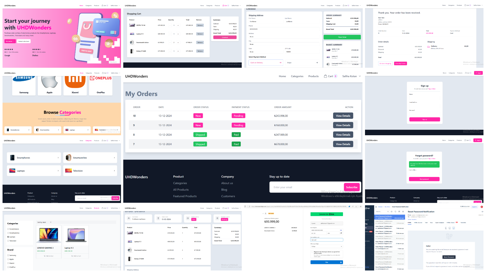
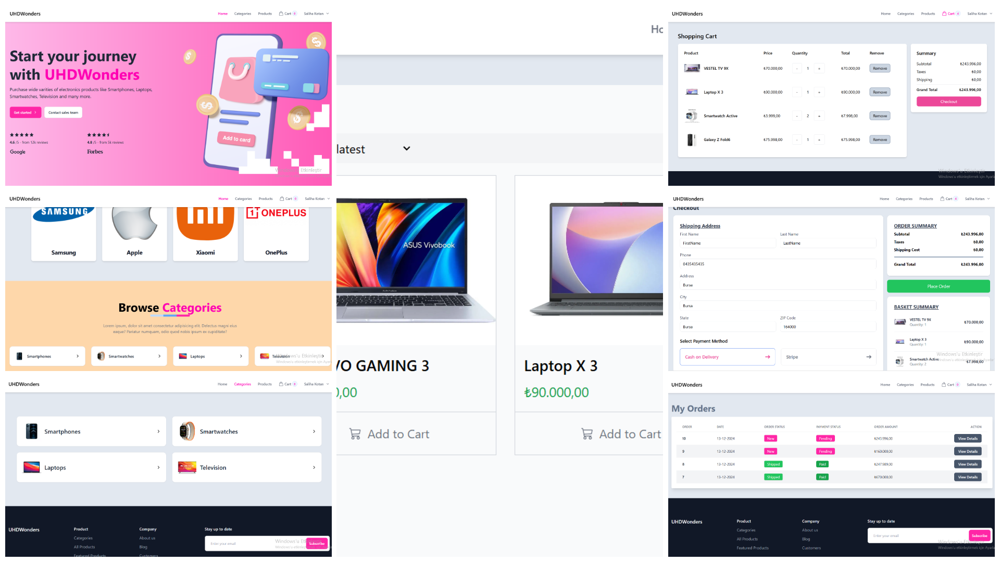
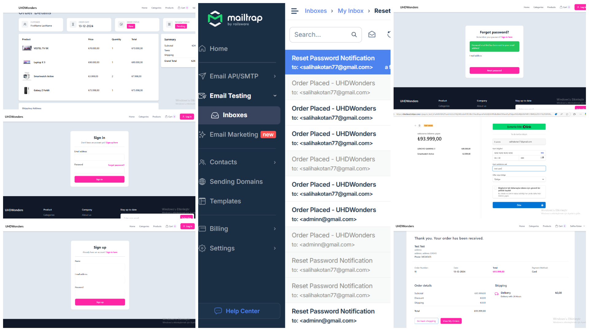
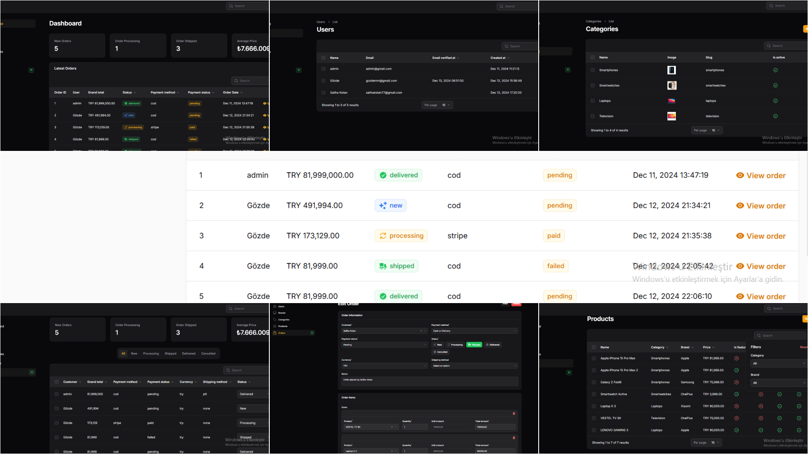

  
  
  
  

---

# Laravel ve Vite Projesi

Bu proje, Laravel framework'ü ile oluşturulmuş modern bir web uygulamasıdır ve modern front-end araçları için Vite ile entegre edilmiştir. Filament, Livewire, Tailwind CSS ve Stripe gibi güçlü paketler çeşitli özellikler ve geliştirmeler için kullanılmaktadır.

---

## Gereksinimler

- **PHP**: ^8.2
- **Node.js**: En son kararlı sürüm (Vite ve npm scriptleri için)
- **Composer**: En son kararlı sürüm

---

## Özellikler

- **Frontend**:
  - Tailwind CSS ile stil oluşturma
  - Preline ile UI bileşenleri
  - Hızlı geliştirme ve optimize edilmiş yapılar için Vite

- **Backend**:
  - Laravel framework
  - Filament ile admin paneli ve kaynak yönetimi
  - Livewire ile dinamik, reaktif UI bileşenleri

- **Üçüncü Taraf Entegrasyonları**:
  - Stripe ile ödeme işlemleri

---

## Kurulum

### Adım 1: Depoyu Klonlayın
```bash
git clone "https://github.com/salihakotan/LaravelECommerceApp.git"
cd LaravelECommerceApp
```

### Adım 2: Bağımlılıkları Yükleyin
#### PHP Bağımlılıklarını Yükleyin:
```bash
composer install
```
#### Node.js Bağımlılıklarını Yükleyin:
```bash
npm install
```

### Adım 3: Ortam Ayarları
1. Örnek ortam dosyasını kopyalayın:
   ```bash
   cp .env.example .env
   ```
2. `.env` dosyasını şu bilgilerle güncelleyin:
   - **Veritabanı bilgileri**
   - **Stripe API anahtarları**
   - **Diğer ayarlar**

### Adım 4: Uygulama Anahtarını Üretin
```bash
php artisan key:generate
```

### Adım 5: Veritabanı Göçlerini Çalıştırın
```bash
php artisan migrate
```

### Adım 6: Geliştirme Sunucusunu Başlatın
Gerekli tüm servisleri çalıştırmak için şu komutu kullanın:
```bash
npm run dev
```

---

## Geliştirme Scriptleri

### Geliştirme İçin Vite Çalıştırın
```bash
npm run dev
```

### Üretim İçin Derleme
```bash
npm run build
```

### Laravel Uygulamasını Çalıştırın
```bash
php artisan serve
```

### Kuyrukları Çalıştırın
```bash
php artisan queue:listen --tries=1
```

### Kombine Servisler (Concurrently Kullanarak)
```bash
npm run dev
```
Bu komut, Laravel sunucusunu, kuyruk dinleyicisini ve Vite geliştirme sunucusunu eş zamanlı olarak çalıştırır.

---

## Temel Araçlar ve Paketler

### Frontend
- **Tailwind CSS**: Hızlı UI geliştirme için utility-first CSS framework
- **Preline**: Önceden tasarlanmış Tailwind CSS bileşenleri
- **Vite**: Hızlı geliştirme ve optimize edilmiş yapılar için modern front-end aracı

### Backend
- **Laravel**: Modern web uygulamaları için PHP framework
- **Filament**: Admin paneli ve kaynak yönetim sistemi
- **Livewire**: Laravel için dinamik, reaktif bileşenler
- **Stripe**: Ödeme işlemleri entegrasyonu

### Geliştirme
- **Pint**: Laravel'in kod stil aracı
- **Pest**: Test framework'ü
- **Concurrently**: Birden fazla süreci eş zamanlı olarak çalıştırma (Laravel sunucusu, Vite, kuyruk dinleyicisi)

---

## Dizin Yapısı

```
├── app/          # Uygulama mantığı
├── database/     # Göçler, fabrikalar ve tohumlayıcılar
├── public/       # Genel varlıklar
├── resources/    # Görünümler, stiller ve JavaScript
├── routes/       # Uygulama rotaları
├── storage/      # Günlükler ve önbellek dosyaları
├── tests/        # Test dosyaları
├── vite.config.js # Vite yapılandırması
└── package.json  # Node.js bağımlılıkları ve scriptler
```

---

## Sık Kullanılan Komutlar

### Artisan Komutları
- Göçleri çalıştır:
  ```bash
  php artisan migrate
  ```

- Uygulamayı çalıştır:
  ```bash
  php artisan serve
  ```

### Composer Komutları
- Bağımlılıkları yükle:
  ```bash
  composer install
  ```

### NPM Komutları
- Bağımlılıkları yükle:
  ```bash
  npm install
  ```
- Geliştirme sunucusunu başlat:
  ```bash
  npm run dev
  ```
- Üretim için varlıkları derle:
  ```bash
  npm run build
  ```

---

## Ek Notlar
- `.env` dosyanızın ortamınıza uygun şekilde doğru yapılandırıldığından emin olun.
- Laravel'e özgü görevleri yönetmek için `artisan` komut satırı aracını kullanın.
- Modern ve verimli bir front-end iş akışı için Vite kullanın.
- Daha fazla bilgi için resmi dokümantasyonları inceleyin:
  - [Laravel Dokümantasyonu](https://laravel.com/docs)
  - [Vite Dokümantasyonu](https://vitejs.dev/)
  - [Tailwind CSS Dokümantasyonu](https://tailwindcss.com/docs)
  - [Filament Dokümantasyonu](https://filamentphp.com/docs)

